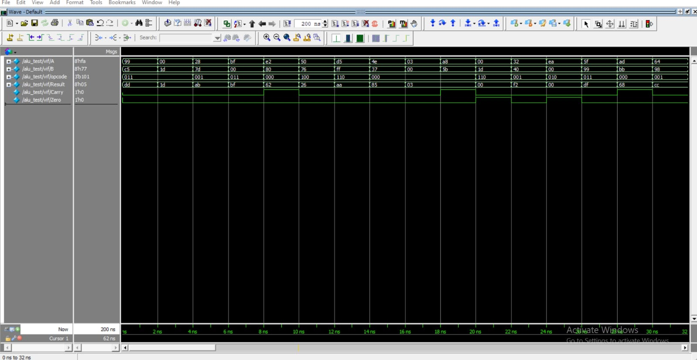

# 8-bit ALU Design and Verification using SystemVerilog

## Overview

This project implements an 8-bit Arithmetic Logic Unit (ALU) and verifies its functionality using SystemVerilog.

The ALU performs arithmetic, logical, and shift operations based on a 3-bit opcode.

A SystemVerilog-based verification environment is developed to generate randomized transactions, drive them to the ALU, monitor the outputs, compare the actual results with expected results, and collect functional coverage.

---

## ALU Operations

The ALU supports 8 operations:

| Opcode | Operation | Description |
|--------|-----------|-------------|
| 000 | ADD | A + B |
| 001 | SUB | A - B |
| 010 | AND | A & B |
| 011 | OR | A \| B |
| 100 | XOR | A ^ B |
| 101 | NOT | ~A |
| 110 | LEFT SHIFT | A << 1 |
| 111 | RIGHT SHIFT | A >> 1 |

---

## Inputs and Outputs

### Inputs

| Signal | Width | Description |
|--------|-------|-------------|
| A | 8-bit | First ALU operand |
| B | 8-bit | Second ALU operand |
| opcode | 3-bit | Selects the ALU operation |

### Outputs

| Signal | Width | Description |
|--------|-------|-------------|
| Result | 8-bit | Result of the selected operation |
| Carry | 1-bit | Carry generated during addition |
| Zero | 1-bit | Indicates whether the result is zero |

---

## Design

The ALU is implemented using SystemVerilog `always_comb`.

The design supports:

- Addition
- Subtraction
- Bitwise AND
- Bitwise OR
- Bitwise XOR
- Bitwise NOT
- Left shift
- Right shift

The `Carry` output is generated for the addition operation.

The `Zero` flag is set when the ALU result is zero.

---

## Verification Environment

The verification environment is developed using SystemVerilog classes.

### Verification Components

- Transaction
- Generator
- Driver
- Monitor
- Scoreboard
- Environment
- Interface
- Functional Coverage
- Immediate Assertion

### Verification Flow

```text
Randomized Transaction
        |
        v
    Generator
        |
        v
      Mailbox
        |
        v
      Driver
        |
        v
       ALU
        |
        v
      Monitor
        |
        v
      Mailbox
        |
        v
    Scoreboard
        |
        v
 Expected vs Actual
        |
        v
     PASS / FAIL
---

## Simulation Results

The ALU was verified using randomized transactions.

- **Total Transactions:** 100
- **PASS:** 100
- **FAIL:** 0

All 100 transactions passed successfully.

## Simulation Waveform



[View Full-Size Waveform](Alu_waveform.jpeg)
